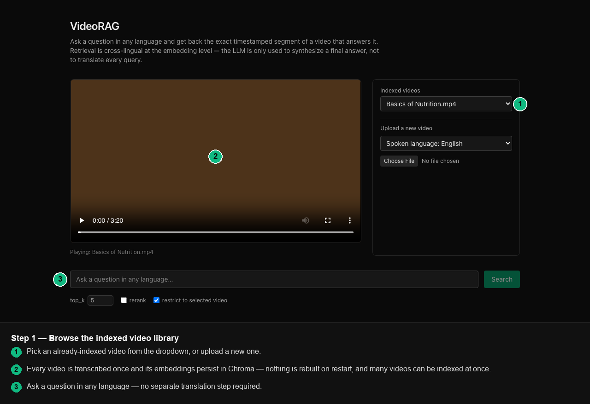
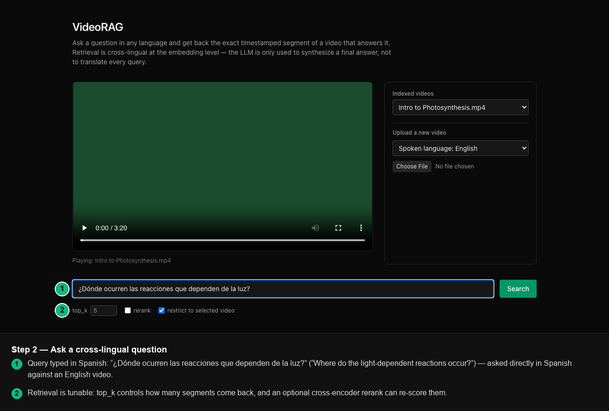
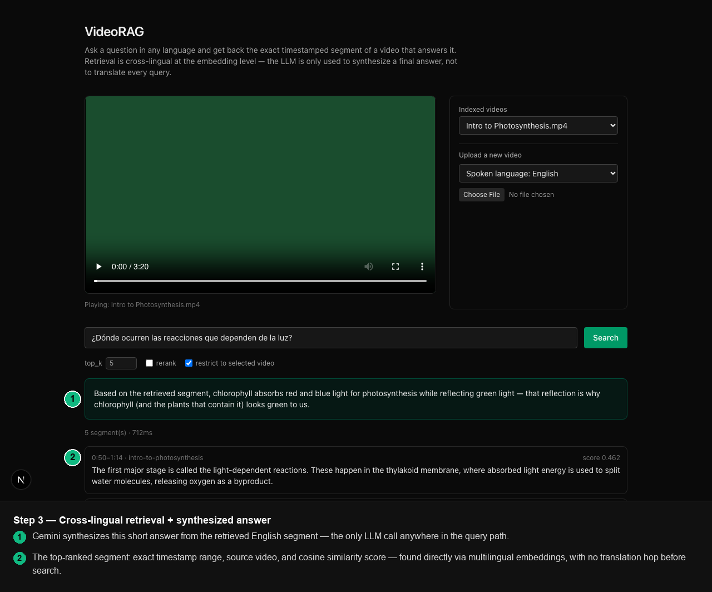
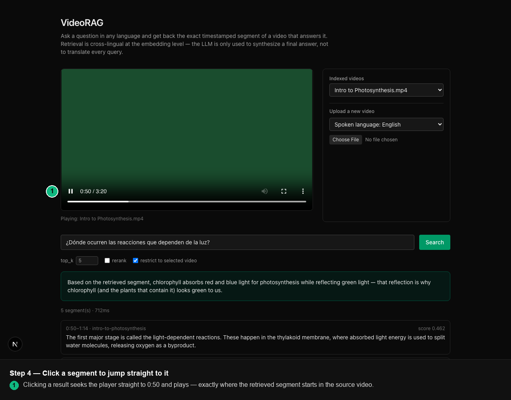
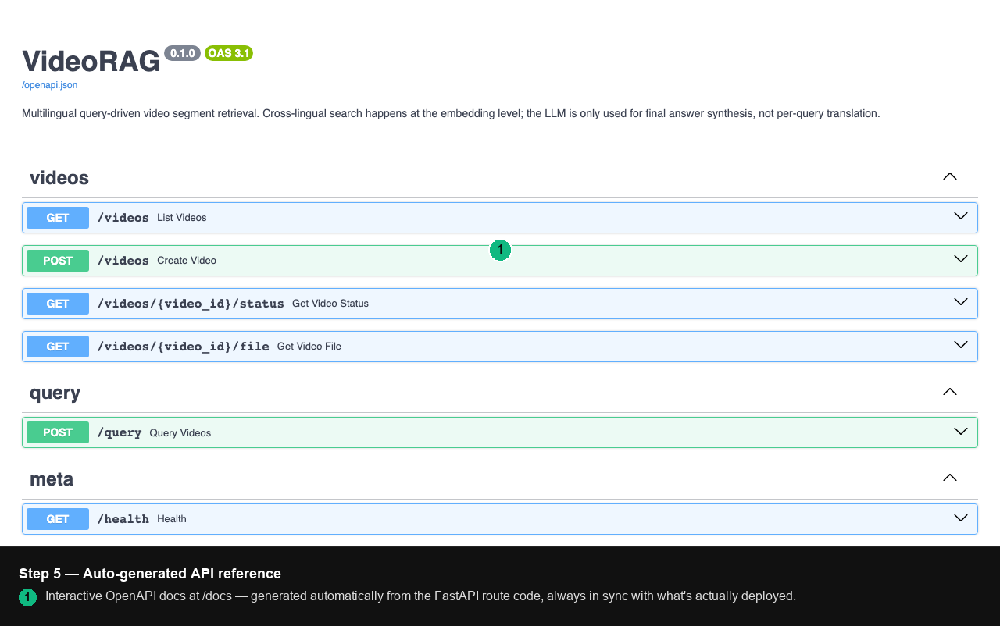
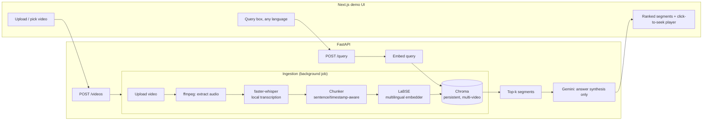

# VideoRAG

Ask a question in any language, get back the exact timestamped segment of a video that answers it — no manual scrubbing, no translating your query first. VideoRAG transcribes uploaded video, chunks and embeds the transcript with a multilingual sentence embedding model, and retrieves the matching segment directly across languages; an LLM is only invoked at the end to synthesize a short answer from the retrieved text, not to translate every query. 

**Live demo (frontend):** https://videorag-demo.vercel.app — deployed on Vercel. **Note:** only the frontend is deployed so far; the backend API isn't hosted anywhere yet, so live queries/uploads on that URL won't return data until it is (see [Future work](#future-work)). The walkthrough below and the local quickstart are the way to see it fully working right now.

## Walkthrough











## Architecture



retrieval is cross-lingual *at the embedding level*. A Hindi or Spanish query embeds close to the English transcript chunk that answers it, because LaBSE maps 100+ languages into a shared vector space. The LLM only runs once per query, to turn the retrieved English segments into a direct answer in the query's language — it is not a per-query translation dependency the way it was in the original prototype.

| | Original prototype | This rebuild |
|---|---|---|
| Index | In-memory FAISS, rebuilt every run, one video | Persistent Chroma, multi-video, survives restarts |
| Secrets | API key hardcoded in the script | `.env` + `pydantic-settings`, never logged, never committed |
| Interface | `input()`/`print()` in a notebook | FastAPI service (`/docs`) + Next.js UI |
| Tests | None | 27 unit/integration tests, mocked Whisper/Gemini/ffmpeg |
| Eval | Numbers in a report, not reproducible | `scripts/run_eval.py` → versioned `eval/results.json`, gated in CI |
| Deploy | N/A | Docker Compose (API + Chroma + frontend) |

## Quickstart

Requires Docker and Docker Compose.

```bash
git clone <this-repo>
cd VideoRAG
cp .env.example .env   # optional: add GEMINI_API_KEY for synthesized answers
docker compose up --build
```

- Frontend: http://localhost:3000
- API docs: http://localhost:8000/docs
- Chroma (debug): http://localhost:8001

First run downloads the LaBSE embedding model (~1.8GB) and a faster-whisper model into a cached volume — later starts are fast. Without `GEMINI_API_KEY` set, `/query` still returns ranked retrieved segments; it just skips the synthesized-answer text.

> **Note on this build:** Docker itself wasn't available in the sandboxed environment this project was built in, so `docker compose up` could not be run end-to-end here. Each Dockerfile stage was verified individually instead — `pip install ".[ml]"` against the real `pyproject.toml`, and the frontend's exact `next build` → standalone `server.js` output was built and run directly, confirming it serves the app. Treat the full compose stack as reviewed-but-not-executed until you run it yourself.

### Local development (no Docker)

```bash
# Backend
python -m venv .venv && source .venv/bin/activate
pip install -e ".[dev,ml]"   # omit [ml] if you only need to run tests
pytest tests -v
uvicorn videorag.api.main:app --reload   # needs a Chroma instance reachable at CHROMA_HOST/PORT

# Frontend
cd frontend
npm install
cp .env.local.example .env.local
npm run dev
```

`pip install -e ".[dev]"` (no `ml`) is enough to run the full test suite — every call into sentence-transformers, faster-whisper, and google-generativeai is lazily imported and mocked in tests, so the heavy model deps are only needed for real inference.

## API reference

Full interactive reference at `/docs` (OpenAPI, generated by FastAPI). Summary:

| Endpoint | Description |
|---|---|
| `POST /videos` | Upload a video (multipart, `file` + `language`). Returns `video_id` immediately; ingestion runs in the background. |
| `GET /videos/{id}/status` | Poll ingestion status: `pending → processing → ready|failed`. |
| `GET /videos` | List all videos and their status. |
| `GET /videos/{id}/file` | Stream the stored video file (used by the player). |
| `POST /query` | `{query, video_id?, top_k?, rerank?, synthesize_answer?}` → ranked segments + optional synthesized answer. Cached (in-memory TTL) and rate-limited per IP. |
| `GET /health` | Liveness check. |

## Evaluation

`scripts/run_eval.py` ingests a labeled dataset, runs real retrieval, and computes precision/recall/F1@k plus latency — this is the actual script that produced the numbers below, not a report figure:

```bash
python scripts/run_eval.py --dataset eval/dataset.json --output eval/results.json
```

**Current results** (`eval/results.json`, 9 hand-written queries across English/Spanish/Hindi, real LaBSE embeddings, top_k=5):

| Metric | Value |
|---|---|
| Hit rate | 100.00% |
| Mean precision@k | 0.944 |
| Mean recall@k | 1.000 |
| Mean F1@k | 0.963 |
| Mean query latency | 112.5 ms |
| p95 query latency | 776.8 ms |

**What this does and doesn't prove:** `eval/dataset.json` points at hand-authored transcript fixtures (`eval/transcripts/*.json`) rather than real recorded video — ingestion runs the real chunking → embedding → Chroma pipeline against them, skipping only the audio-extraction/Whisper step, since these are plain-text stand-ins for short talks, not actual video files. Retrieval, embedding quality, and the metrics themselves are 100% real. Swapping in real recorded video (and running the full ffmpeg → faster-whisper path end-to-end) is tracked as follow-up work.

CI runs the same script on a separate, tiny 2-query fixture (`eval/fixture/`) with a fake deterministic embedder — no model download, just a regression gate on the harness itself (`--min-hit-rate 1.0`). It is not used to produce the numbers above.

## Testing

```bash
pytest tests -v            # 27 tests: chunking, embedding, Chroma store, full API surface
ruff check src tests scripts
black --check src tests scripts
```

Whisper, Gemini, and ffmpeg are mocked throughout — the suite needs no API key, no GPU, and no real video files.

## Known limitations

- **Ingestion job queue is SQLite, not Celery/Redis.** Fine for a single API process; won't scale to distributed workers without swapping `JobStore` for a real queue.
- **Query cache is in-process (`cachetools` TTL cache),** not shared across multiple API replicas — would need Redis behind a horizontally-scaled deployment.
- **Reranking (cross-encoder) is implemented but off by default** (`rerank: true` in the query body) and isn't reflected in the eval numbers above.
- **Eval dataset uses transcript fixtures, not real video** — see the Evaluation section.
- **API-based transcription backend is a proven-swappable stub**, not a real implementation — `TRANSCRIPTION_BACKEND=api` exists to demonstrate the interface, not to be used yet.
- **Backend isn't deployed.** Frontend is live on Vercel; the API/Chroma side still needs a host — see Future work.

## Future work

- Deploy the API + Chroma (Render/Fly.io/Railway) with a small pre-indexed sample, then point the Vercel frontend's `NEXT_PUBLIC_API_URL` at it so the live demo is fully functional end-to-end.
- Replace eval transcript fixtures with real short CC-licensed videos, run end-to-end through ffmpeg + faster-whisper.
- Implement a real hosted-API transcription backend behind the existing `TranscriptionBackend` interface.
- Redis-backed cache and a real task queue for multi-instance deployment.
- Benchmark the cross-encoder reranker's actual effect on precision/recall before turning it on by default.

## Stack

FastAPI · Chroma · sentence-transformers (LaBSE) · faster-whisper · Gemini · Next.js/TypeScript/Tailwind · pytest · GitHub Actions · Docker.
